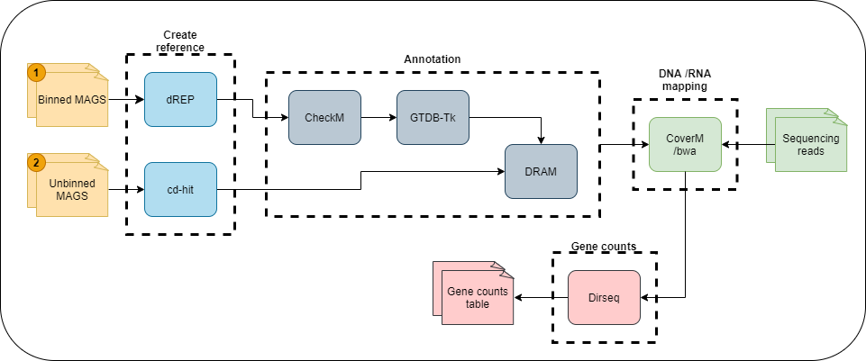

# metaT_pipe

<p align="center"></p>

Scripts for running metatranscriptomic analysis

## Dependencies

The following software is required to run this pipeline:
- [dRep](https://github.com/MrOlm/drep) pipeline used to "de-replicate" genomes
- [cd-hit](https://github.com/weizhongli/cdhit/wiki) "de-replication" of contigs using clustering
- [DRAM](https://github.com/shafferm/DRAM/wiki) metagenomic assembled genomes annotation
- [CheckM](https://github.com/Ecogenomics/CheckM) quality control of metagenomes
- [GTDB-Tk](https://ecogenomics.github.io/GTDBTk/) taxonomic assignment
- [CoverM](https://github.com/wwood/CoverM) reads mapping
- [dirseq](https://github.com/wwood/dirseq) gene counts

## Installation

- Clone the repository in your home directory and make the script executable 

```
git clone https://github.com/Coayala/metaT_pipe.git
cd metaT_pipe
chmod +x metaT_pipe.py
```
- Create and activate environment

```
conda env create -f environment.yml
conda activate metaT_pipe
```
- Finish DRAM and GDTB-Tk installation

**For DRAM** follow the instructions for [DRAM septup](https://github.com/shafferm/DRAM/wiki#dram-setup)

**For GDTB-Tk** run the following
```
download-db.sh
```
- Finish Dirseq installation

```
gem install dirseq
```

## Usage

- Get help with the following command
```
PATH_TO_META_PIPE/metaT_pipe.py -h
```


